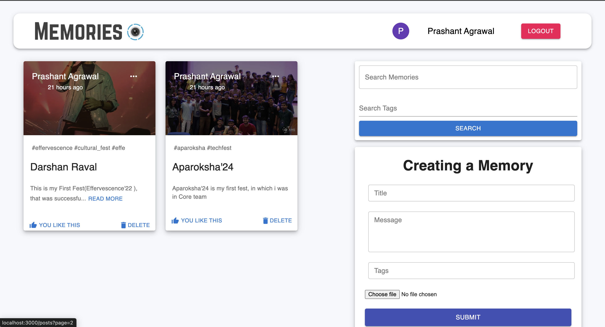

```md
# Memories Application

A simple full-stack MERN (MongoDB, Express, React, Node.js) application for sharing memorable moments with images and descriptions. The app supports user authentication, Google sign-in, and allows users to create, edit, and delete posts.

## Features

- User Authentication (JWT & Google OAuth)
- Create, Edit, and Delete Posts
- Google OAuth Integration for Signing In
- Responsive Design with Material UI

## Tech Stack

- **Frontend**: React, Material-UI
- **Backend**: Node.js, Express.js
- **Database**: MongoDB
- **Authentication**: JWT (JSON Web Token), Google OAuth

## Project Structure

```bash
📂client               # Frontend React application
 ┣ 📂components        # Reusable components (Navbar, Auth, Forms, Posts, etc.)
 ┣ 📂actions           # Redux actions (auth, posts)
 ┣ 📂reducers          # Redux reducers
 ┣ 📂styles            # Styling for components
 ┣ 📂images            # Static assets
 ┗ 📄App.js            # Main application file

📂server               # Backend Node.js application
 ┣ 📂controllers       # Controllers for handling routes (auth, posts)
 ┣ 📂models            # MongoDB models (User, PostMessage)
 ┣ 📂routes            # API routes (auth, posts)
 ┣ 📂middleware        # JWT middleware (auth.js)
 ┣ 📂config            # Configuration files (database connection)
 ┗ 📄server.js         # Main server file
```

## Installation

### Prerequisites

- [Node.js](https://nodejs.org/en/)
- [MongoDB](https://www.mongodb.com/)
- [Git](https://git-scm.com/)

### Steps to Run the Project Locally

1. **Clone the repository**:

   ```bash
   git clone https://github.com/agrawal-2005/memories.git
   ```

2. **Navigate to the project directory**:

   ```bash
   cd memories
   ```

3. **Install the dependencies**:

   - For the client (React app):

     ```bash
     cd client
     npm install
     ```

   - For the server (Node.js app):

     ```bash
     cd ../server
     npm install
     ```

4. **Set up environment variables**:

   Create a `.env` file in the `server` directory and add the following variables:

   ```bash
   PORT=4000
   MONGO_URL=your_mongo_database_url
   JWT_SECRET=your_jwt_secret
   GOOGLE_CLIENT_ID=your_google_client_id
   ```

   Replace the values with your actual MongoDB connection string, JWT secret, and Google OAuth Client ID.

5. **Run the client**:

   ```bash
   cd ../client
   npm start
   ```

6. **Run the server**:

   ```bash
   cd ../server
   npm start
   ```

   The app should now be running locally. The client will be available at `http://localhost:3000` and the server at `http://localhost:4000`.

## Authentication

- **JWT Authentication**: The app uses JSON Web Tokens (JWT) to manage user sessions. After signing in, the token is stored in localStorage and automatically attached to API requests.
  
- **Google OAuth**: You can sign in using your Google account. Make sure to provide your Google OAuth Client ID in the `.env` file to enable this feature.

## Screenshots



## Troubleshooting

- **JWT Token Issues**: If you're facing errors related to token verification (e.g., invalid algorithm), ensure that the token is being properly decoded and passed with requests.
  
- **React Warnings**: You may see warnings related to React hooks (such as missing dependencies in `useEffect`). To fix these, you may need to use `useCallback` for functions like `logout`.

## Contributions

Feel free to fork this repository and submit pull requests for new features, bug fixes, or enhancements. Contributions are welcome!


### Key Sections
- **Features**: Highlights the main functionality of the app.
- **Tech Stack**: Lists the technologies used.
- **Installation**: Step-by-step guide on how to set up and run the project locally.
- **Authentication**: Information about JWT and Google OAuth authentication.
- **Troubleshooting**: Addresses common issues.
- **Contributions**: Encourages contributions to the project.